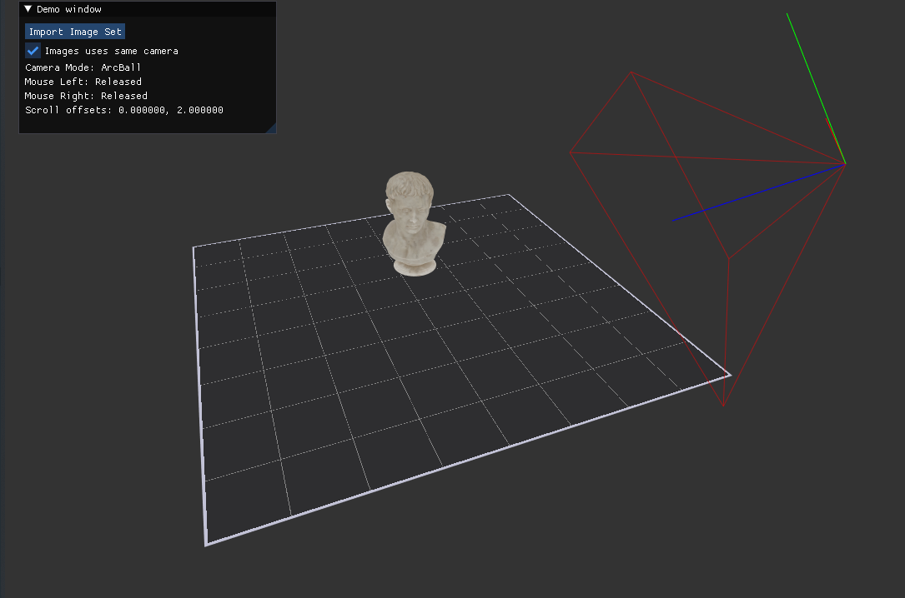

# 3D Reconstruction and Experimentation Software



This Real Time 3D Reconstruction Software (RT3DRS), is a C++/CUDA research project for interacting with 3D scenes, handling dataset loading, volumetric rendering, and related 3D (maybe 4D one day)reconstruction experiments. The repository combines an OpenGL viewer, Dear ImGui tools, CUDA kernels, NeRF-style dataset loading, and a collection of Python utilities used for preprocessing and experimentation.

## Project Status

This repository is being brought back into active maintenance from this early 2026 in order to improve code quality, add modularity to extract core features into easy-to-share piece of software and much more.

The checked-in code already contains useful subsystems, but it still reflects an older research-project layout done a little more than 2 years ago.

## What Exists Today

- A desktop application built with GLFW, GLEW, OpenGL, Dear ImGui, and ImPlot
- A scene graph centered on [`Scene`](src/controllers/Scene/Scene.hpp) and [`SceneObject`](src/view/SceneObject/SceneObject.hpp)
- CUDA-backed dense and sparse volume experiments, ray casting, plane cutting, and optimization
- A NeRF dataset loader that creates `ImageSet` and `CameraSet` children
- Small GoogleTest coverage for Morton / sparse octree helpers
- A separate `python/` area with preprocessing, calibration, dataset, and experiment scripts, treated as ancillary tooling rather than the main implementation path

## Architecture At A Glance

1. [`src/main.cpp`](src/main.cpp) initializes GLFW, GLEW, ImGui, OpenGL state, CUDA device selection, and the main render loop.
2. [`AppController`](src/controllers/AppController/AppController.hpp) acts as the current composition root and builds the default scene content plus UI interactors.
3. [`Scene`](src/controllers/Scene/Scene.hpp) stores root scene objects, tracks the active camera, and renders active objects.
4. [`SceneObject`](src/view/SceneObject/SceneObject.hpp) gives renderable objects an id, activation state, optional child objects, and an editor-facing type.
5. [`ObjectListInteractor`](src/interactors/ObjectListInteractor.hpp) and [`ObjectListView`](src/view/ImUI/ObjectListView.hpp) expose the scene graph in the "Objects" ImGui window.
6. [`SceneObjectInteractor`](src/interactors/SceneObjectInteractor.hpp) routes the current selection to type-specific interactors and inspectors.
7. The main implementation work lives in `src/model/`, `src/view/`, `src/cuda/`, and `src/utils/`.

## Repository Layout

| Path | Purpose |
| --- | --- |
| `src/` | First-party C++, CUDA, shaders, and UI code |
| `src/controllers/` | Scene ownership and top-level app composition |
| `src/interactors/` | UI-to-scene coordination layer |
| `src/model/` | Datasets, cameras, volumes, optimization, and rendering-adjacent domain code |
| `src/view/` | Renderables, helpers, and ImGui editors |
| `src/cuda/` | CUDA kernels, descriptors, and GPU helpers |
| `src/shaders/` | GLSL shader programs loaded at runtime |
| `tests/` | GoogleTest-based C++ tests |
| `python/` | Supporting scripts and experiments not integrated into the CMake app |
| `include/` | Vendored or embedded third-party dependencies and headers |
| `external/` | Additional vendored dependencies such as GoogleTest and libmorton |
| `docs/` | Hand-written project documentation |

More detail is documented in [`docs/project-structure.md`](docs/project-structure.md).

## Build Overview

The current checked-in build system is still the legacy one and has not yet been modernized:

- `cmake_minimum_required(VERSION 3.10)`
- C++ standard currently set to `17`
- CUDA language enabled directly in the root target
- hard-coded CUDA architecture currently set to `89`
- broad use of global include directories and manually maintained source lists

Typical historical build flow:

```sh
mkdir -p build
cd build
cmake ..
cmake --build . -j
```

### External dependencies referenced by the current build

- CUDA
- OpenGL
- GLEW
- GLFW
- OpenCV
- Assimp
- zlib and window-system libraries required by GLFW / OpenGL on Linux

Several dependencies are vendored under `include/` and `external/`, but not all system libraries are. The old README also pinned the host compiler to GCC 8; that should be treated as historical context, not the long-term target.

## Runtime Asset Assumptions

The current executable expects some resources at runtime via relative paths:

- shaders under `../src/shaders/`
- icon font under `../include/icons/fa-solid-900.ttf`
- datasets and HDRI assets under `../data/...`

Important: there is currently no tracked `data/` directory in the repository. That means datasets, HDRIs, and other runtime assets must be provided separately before the viewer can exercise its full pipeline.

## Current Documentation Notes

- A `Doxyfile` exists, but the checked-in `docs/index.html` is currently only a placeholder.
- When the codebase is reorganized, these docs should be updated in the same change.

## License

This repository is distributed under the terms of the [`LICENSE`](LICENSE) file.
